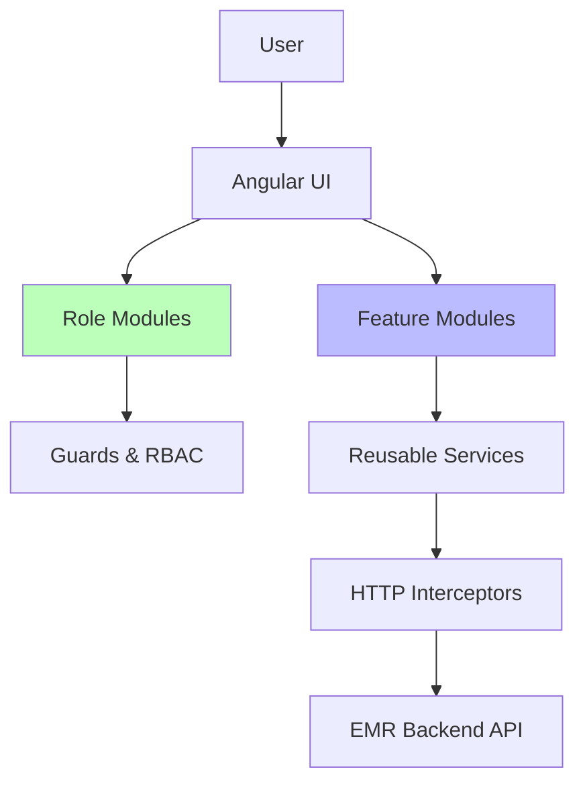

# 🖥️ EMR-Suite Frontend

**Role-Based Angular + Ionic Frontend for a Production-Grade EMR System**


---

## 📌 Overview

**EMR-Suite Frontend** is a **modular, role-based Angular + Ionic application** designed for real-world **Electronic Medical Records (EMR)** workflows.

The application is structured around **two complementary concepts**:

1. **Role-based modules** → *Who is using the system*
2. **Feature modules** → *What the system does*

This separation allows:

* Clean scalability
* Feature reuse across roles
* Clear ownership of business logic

> ⚠️ **Framework Version Notice**
> This project currently uses **Angular 13.1** intentionally.
>
> The focus of this demo is **healthcare domain complexity, data integrity, and workflow correctness**, not framework upgrades.
>
> An upgrade to a newer Angular version is planned for a subsequent iteration.

---

## 🎯 Key Capabilities Demonstrated

✔ Enterprise Angular architecture
✔ Feature-based + role-based separation
✔ Healthcare workflow modeling
✔ Strong form validation & UX
✔ Secure backend integration
✔ Mobile-ready via Ionic

---

## 🧠 Architectural Philosophy

* **Feature-first business logic**
* **Role-based UI orchestration**
* **Shared services & components**
* **Reactive programming with RxJS**
* **Backend-driven permissions**
* **Future-proof modular design**

---

## 🏗️ High-Level Architecture



---

## 🧩 Application Structure

```
src/app/
├── core/
├── shared/
├── modules/        # WHO is using the system
├── features/       # WHAT the system does
├── layouts/
├── app-routing.module.ts
└── app.module.ts
```

---

## 👥 Role-Based Modules (`modules/`)

These modules define **user access and UI flow**.

```
modules/
├── admin/
├── authentication/
├── doctor/
├── nurse/
├── patient-access/     # Receptionist
└── patient-portal
```

### 🛠️ Admin

* System oversight
* Personnel visibility
* High-level dashboards

### 🔐 Authentication

* Login / Logout
* Session handling
* Route protection

### 👨‍⚕️ Doctor

* Clinical notes
* Patient chart access
* Diagnosis & treatment review

### 👩‍⚕️ Nurse

* Vitals capture
* Patient monitoring
* Care coordination support

### 🧑‍💼 Patient-Access (Receptionist)

* Patient registration
* Appointment scheduling
* Front-desk workflows

### 🧍 Patient Portal

* Profile access
* Appointment history
* Limited medical visibility

---

## 🧠 Feature Modules (`features/`)

Feature modules contain **core business capabilities** that can be reused across multiple roles.

```
features/
├── billing/
├── dashboard/
├── patient-chart/
├── personnel/     # Staff management
└── schedule/      # Appointments
```

### 💳 Billing

* Payment records
* Invoices
* Revenue tracking (paid vs pending)
* Role-aware visibility (Admin / Reception)

---

### 📊 Dashboard

* KPIs & summary cards
* Patient counts
* Appointments overview
* Revenue snapshots

Used by:

* Admin
* Doctor
* Receptionist

---

### 📁 Patient Chart

* Centralized patient medical record
* Clinical history
* Vitals & notes aggregation

Consumed by:

* Doctors
* Nurses (read/write where permitted)

---

### 👥 Personnel (Staff)

* Staff listing
* Role classification
* Department grouping

Primarily for:

* Admin users

---

### 📅 Schedule (Appointments)

* Appointment creation
* Today / Past / Upcoming views
* Status management

Used by:

* Receptionist
* Doctors
* Patients (read-only)

---

## 🔁 Role + Feature Interaction (Example)

| Feature       | Admin | Doctor | Nurse | Receptionist | Patient |
| ------------- | ----- | ------ | ----- | ------------ | ------- |
| Dashboard     | ✅     | ✅      | ❌     | ✅            | ❌       |
| Patient Chart | ❌     | ✅      | ✅     | ❌            | 🔒      |
| Billing       | ✅     | ❌      | ❌     | ✅            | 🔒      |
| Schedule      | ✅     | ✅      | ❌     | ✅            | ✅       |
| Personnel     | ✅     | ❌      | ❌     | ❌            | ❌       |

🔒 = Restricted / read-only

---

## 🧾 Forms & UX Standards

* Reactive Forms
* Controlled dropdowns (Nationality, State, Gender)
* DOB future-date restrictions
* Inline validation feedback
* Material Design components

---

## 🔐 Security (Frontend Layer)

* Route Guards per role
* HTTP Interceptors
* Token expiry handling
* UI-level access enforcement

---

## 🧠 State & Data Flow

* RxJS `Observable` streams
* Stateless components
* Centralized services
* Clean DTO mapping

---

## 📁 Complete Folder Snapshot

```bash
src/app/
├── core/
│   ├── guards/
│   ├── interceptors/
│   └── base-api.service.ts
├── shared/
│   ├── components/
│   ├── dialogs/
│   ├── services/
│   └── utils/
├── modules/
│   ├── admin/
│   ├── authentication/
│   ├── doctor/
│   ├── nurse/
│   ├── patient-access/
│   └── patient-portal/
├── features/
│   ├── billing/
│   ├── dashboard/
│   ├── patient-chart/
│   ├── personnel/
│   └── schedule/
├── layouts/
├── app-routing.module.ts
└── app.module.ts
```

---

## 🚀 Running the App

```bash
npm install
npm start
```

Runs on:
👉 `http://localhost:4200`

---

## 📱 Ionic Support

* Web
* Android
* iOS

```bash
ionic serve
ionic build
ionic cap sync
```

---

## 🔮 Planned Enhancements

* Angular upgrade (v17+)
* Standalone components
* Signals-based state
* Improved lazy loading
* Performance tuning

---

## 👨‍💻 Author

**Busade Adedayo**
Senior Software Engineer — Healthcare Systems

---

## 🏁 Final Recruiter Takeaway

This frontend demonstrates:

✅ Real EMR workflows
✅ Clear architectural thinking
✅ Feature reuse across roles
✅ Production-ready design
✅ Engineering maturity

This is **not a tutorial app** — it’s a **healthcare system frontend**.

---